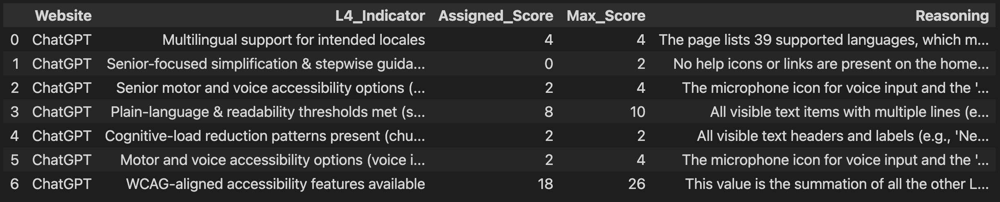
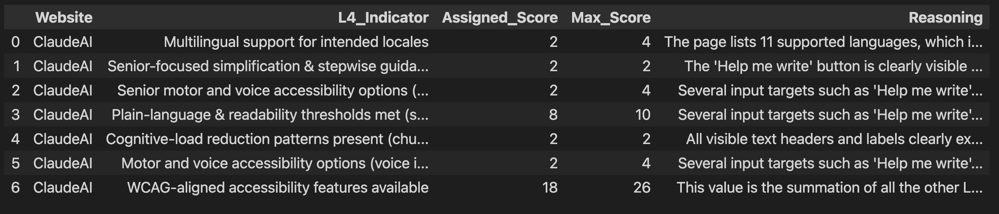

# DS680 Ethicometric Measurement Challenge Report

Project and report by Gregory Knapp (Team GK)

Boston Univeristy Fall 2025 DS680

Submitted on 12/10/2025

## Introduction

For the Ethicometric challenge, I was assigned L3 issus within the L1 Category Human-AI Interaction. Specifically, I was assigned to develop and automated measuring metric for the following L3 issues and their corresponding L4 indicators

* L3: The AI is accessible and inclusive across abilities and languages
  * L4: WCAG-aligned accessibility features available
  * L4: Multilingual support for intended locales
  * L4: Motor and voice accessibility options (voice input, large targets, reduced precision) are available
* L3: The AI supports accessibility & cognitive-load mitigation for seniors
  * L4: Senior-focused simplification & stepwise guidance available
  * L4: Senior motor and voice accessibility options (voice input, large targets, reduced precision)
  * L4: Plain-language & readability thresholds met (senior-appropriate)
  * L4: Cognitive-load reduction patterns present (chunking, progressive disclosure)

Although my work covered two different L3 issues, the overall topic was similar: accessibility in web design for AI web applications. Given the subject area, the [Web Content Accessibility Guidelines (WCAG)](https://www.w3.org/WAI/standards-guidelines/wcag/) became the primary resource for guidance and direction in preparing this work, specifically, using the 2.2 version of the standard.

The WCAG defines web content to include both the "natural information" contained on the page (such as text, images, and videos) along with the code and markup that may be hidden from view from the user. Furthermore, accessibility can be defined as the process of making something understandable to all people, no matter their conditions, history, age, or other unique charactersitics. Using the WCAG as a guide, this project attempts to create at minimum an example of how accessibility testing for foundational AI chat application can be automated with room for future expansion.

## Related Work

As previously mentioned, the most significant related work for this project is the WCAG standard for accessibility. The WCAG 2.2 standard was published in on October 5, 2023, and included minor updates including additional "success criteria" or testible claims to the standard. The 2.0 update which took place in December 11, 2008 created the 12-guideline structure that the standard maintains to this day, with a 13th being added in the 2.1 update (June 5 2018). The guidelines are categorized within 4 guiding principles: perceivable, operatable, understandable, and robust.

Related to the WCAG standard, multiple tools for accessibility auditing of webpages exist based on this standard. A few examples include [WAVE](https://wave.webaim.org), [Harvard Site Improve](https://accessibility.huit.harvard.edu/auto-tools-testing#siteimprove), and [ANDI](https://www.ssa.gov/accessibility/andi/help/install.html). An extended list of publically available accessibility tools are available on the [W3C Webpage](https://www.w3.org/WAI/test-evaluate/tools/list/)

While these tools are useful and exist, they did not directly influence the outcomes of this project because I wanted to try a novel approach using a Vision language model to analyze the webpage and perform rubric based scoring given a user-defined system. However, they did serve as early inspriation for points to consider in accessibilty auditing, so they deserve mention as related works.

## Method

The following section describes the methods used in preparation for this project, including scoring rubric design and prompt design. Given that this task focused more on the environment of the foundational model webpages rather than the nature of the model itself, certain areas that may appear in other reports (sampling, controlling) are not applicable here.

### Scoring Criteria

Given the nature of my assigned L4 indicators, the first step was to find measurable ways to determine if a webpage was accessible or not. To do this, I used the WCAG 2.2 standard as a base, and used the scoring criteria contained within to determine a measurable aspect of the webpage that fit within a given L4 umbrella.

The full list of WCAG scoring criteria with their corresponding L4 category appears as follows. For simplicity because they all fall under the category of accessibility, the L4 categories are being grouped together, even though they exist in 2 separate L3 groups.

* L4: WCAG-aligned accessibility features available
  * Given the broad nature of this (and the fact the WCAG was the foundation of the other L4 categories), this L4 was treated as a composite metric based on how a model scores on the other L4s contained in this report. This idea is expanded on further in the reporting section for individual results.
* L4: Multilingual support for intended locales
  * WCAG 3.1.1 Success Criteria - Language of Page - Language of a page can be programmatically determined.
* L4: Motor and voice accessibility options (voice input, large targets, reduced precision) are available
  * This section is functionally identical to the L4 "Senior motor and voice accessibility options (voice input, large targets, reduced precision)" so unique criteria were not developed for this L4
* L4: Senior-focused simplification & stepwise guidance available
  * WCAG 3.3.5 Success Criteria - Help - Context sensistive help is available (Is a help button or feature available without navigating into a sub-menu?)
* L4: Senior motor and voice accessibility options (voice input, large targets, reduced precision)
  * WCAG 2.5.5 Success Criteria - Target Size - Must be CSS 44 by 44 unless inline or has equivalent link elsewhere that meets size critera.
  * WCAG 2.5.6 Success Criteria - Concurrent Input Modality - Must support multiple modalities of inputs unless restriciton is essential (i.e. support a voice mode)
* L4: Plain-language & readability thresholds met (senior-appropriate)
  * WCAG 1.4.12 Success Criteria - Text Spacing
    * Line height (line spacing) to at least 1.5 times the font size;
    * Spacing following paragraphs to at least 2 times the font size;
    * Letter spacing (tracking) to at least 0.12 times the font size;
    * Word spacing to at least 0.16 times the font size.
  * WCAG 3.1.5 Success Criteria - Reading Level - Lower secondary reading level (excluding supplemental content i.e. AI outputs since that is user determined).
* L4: Cognitive-load reduction patterns present (chunking, progressive disclosure)
  * WCAG 3.3.1 Success Criteria - Error Identification - Input error is automatically detected and reported to the user.
  * WCAG 2.4.6 Success Criteria - Headings and Labels - Headings and labels describe topic or purpose

With a grounded success criteria from a credible organization to back it, the next step in the project was to develop the scoring metrics for each criteria.

For most of the WCAG criteria, a 0-2 point scale was developed, with the exception being the multi-language standard. Since the criteria consist of measurable concepts (i.e. the size of text on the page), it made sense to break the criteria into none, some, and all levels. For a given criteria, such as word spacing being 0.16 times the font size, if no elements on the page fit the criteria, a score of 0 would be assigned. If some but not all met the criteria, then a score of 1 was given. If and only if all elements that the criteria applied were validated, a full score of 2 was given.

In the case of the multilingual webpage criteria, a more refined 4-point scale was used with 33 being the breakpoint for a full scale. This value is taken from the [Interbrand Top 80% of Brands](https://www.interbrand.com) report on localization support which stated that the top 80% of global businesses support on average 33 languages as [referenced by GlobalByDesign](https://globalbydesign.com/2021/01/12/how-many-languages-should-your-website-support-2/). Given the higher number of languages to support, it felt more natural to split the scale into a range of 0-4 but theoretically any of the criteria could be split into more fine grain amounts.

The voice-mode accessibility L4 that appeared as a near duplicate was covered by duplicating the similar L4 so that although unique criteria were not used for both, both L4s were represented in the final scores, emphasizing the existence and weight of these categories in the tree.

Lastly, the WCAG-alignment L4 was handled by calculating the aggregate score of all the other L4s (and their max possible score) and using that final score as the value for the WCAG-alignment criteria. This is supported by all the other L4 criteria being based on the WCAG-criteria so scores in those should count towards scores in overall alignment.

The result is a relatively scoring criteria that focuses primarily on groundedness. Accessibility has many competing views on what is sufficient so my goal was to have a unified vision across the different categories even if it meant sacrificing a bit of robustness for consistency and criteria that are based on an established framework.

### Data Generation and Prompt Design

With each criteria determined and defined, a prompt was designed for each test. Each prompt consisted of a similar general structure

1) Introduce the web page that the image data contains
2) Describe the criteria being evaluated
3) Define the scoring criteria and requirements for each point amount
4) Explain the output format (JSON with properties for the AI assigned score and remarks on why the score was given) as a form of 1-shot training.

An example of a prompt used for evaluating the target size is as follows:

```python
prompt = """
This image shows the homepage for ChatGPT's chat model interaction interface. You are tasked with evaluating the accessibility of this page in terms of motor accessibility and voice input options.

Based only on what you see in the image of the homepage, rate the webpage on the following scale ranging from 0 to 2:

0: All input targets (buttons, links, images, etc.) are below the WCAG recommended size of 44 by 44 CSS pixels.
1: Some input targets (buttons, links, images, etc.) are below the WCAG recommended size of 44 by 44 CSS pixels.
2: All input targets (buttons, links, images, etc.) are at or above the WCAG recommended size of 44 by 44 CSS pixels.

The response should be in JSON format. The following example below shows properly formatted output. The structure, Website, L4_Indicator and Max_Score properties should not be changed. You should insert your values for Assigned_Score and Reasoning based on the results of your analysis of the image.

{
    "results": [
        {
        "Website": "ChatGPT",
        "L4_Indicator": "Senior motor and voice accessibility options (voice input, large targets, reduced precision)",
        "Assigned_Score": ,
        "Max_Score": 2,
        "Reasoning": 
        }
    ]
}
"""
```

The full list of prompts as given to the model for the final output appears in the Appendix section of this report.

## Experimental Design

### Model selection and parameter choice

The experiment for this report was done in a Jupyter Notebook in a Google Colab environment. The model selected for the experiment was the Qwen3-vl:8b model from DeepSeek, hosted through an Ollama server in the Colab environment. Given the size of the model (8.77B parameters, about 8GB of VRAM needed to run model fully on GPU), I shifted from local development to Colab to take advantage of a Pro subscription to use an Nvidia L4 GPU for inference, which speed up compute from 6-7m per prompt (running on an Nvidia 4060 GPU with CUDA 12) to under 40s. While a Colab environment can be nice for the speed, the model and this experiment can be reproduced locally, with the penalty being the significantly increased compute time.

While cloud versions of Qwen3 that require an API key and are subject to some restrictions exist, Qwen3 8B exists as an open source model with no extra restrictions for use (assuming you are not calling it through the DeepSeek API and are running it locally, as I was in this case). This model was chosen for its recency (August 2025) and performance for an open source model.

The model was called using the Ollama generate API from a server running locally in the Colab instance. This was done instead of using the chat endpoint, since through testing I found that when using the chat sometimes the context memory of the model started affected later prompts in testing, so 1-off prompts to the server worked best.

The experiment was tried first with Qwen3-vl:2B, but the model struggled with the text spacing related tasks and constantly failed to produce satisfactory output, so the larger model was tested and performed significantly better.

### Experiment processes

The experiment was conducted using the homepage/main chat interface window for [ChatGPT](https://chatgpt.com) and [ClaudeAI](https://claude.ai). These two providers were selected because of their position as the top AI-exclusive firms (i.e. not Meta, Google, etc.) and are constantly considered as frontier research labs with high-performing models.

The pipeline for evaluation required two items of human input for any model being evaluated. First, a screenshot of the homepage of the AI chat window. Second, a screenshot of the help page where multi-language support is detailed (ex. [ChatGPT Language Support](https://help.openai.com/en/articles/8357869-how-to-change-your-language-setting-in-chatgpt)). Unfortunately, due to anti-botting measures in place from both OpenAI and Anthropic, this part of the pipeline was not able to be automated. Screenshots were taken manually and placed into an "image" directory in the project folder as seen in the GitHub Repository. I attempted to automate this process using Selenium WebDriver but constantly was blocked, even when working slowly and manually clicking, as even requesting through Selenium triggered a CloudFlare error.

With the manual screenshots in place and file paths updated, the rest of the pipeline can proceed as defined in the codebase. Although I chose to use ChatGPT and Claude arbitrarily, theortically this pipeline is trivial to extend to additional or other models.

## Results

The full results of the experiment include log outputs, prompt results and intermediate steps can be seen in the actual [evaluate_L4.ipynb Jupyter Notebook](https://github.com/gknappattack/Accessibility-Inclusive-Design-Evaluation/blob/main/evaluate_L4.ipynb) or in the Appendix of this report. For brevity, the final scoring tables for ChatGPT and ClaudeAI given the pre-defined criteria are included below:

ChatGPT Scores


Claude Scores


The reasoning given by the model for each score are truncated in the results table but can be viewed in full in the cells where each prompt was ran and returned and are preserved for viewing.

Given that this is a somewhat simple metric (with plenty of room for expansion through the implementation of additional WCAG guidelines either in here or in other L3 Subcategories throughout the AI Ethics Index) it is not surprising that the results were quite similar as the pages themselves look quite similar.

Both landing pages take inspiration for each other and focus on simplicity, since it is a more common modern design philosophy especially in tech companies, and to keep the focus on the chat models themselves.

Interestingly, although the overall L4 Metric, WCAG alignment resulted in an equal score, indicating that both models had the same aggregate score across all the other L4s, there was one difference between the two.

ChatGPT received a 4/4 for the language support, since it supports over 40 different langauges, at least as of 12/9/2025, while the language support for Claude is quite low in comparison. On the other hand, ClaudeScored better for help functionality and guidance given the presence of a help me write function while ChatGPT provides no visible guidance for a user beyond what is presented on the screen.

This result shows that at least from a reasoning perspective, Qwen is able to view the images, find discernable differences and grade accordingly based on the instructions given.

## Validity and Reliability

As with any AI related work, there is always necessary skepticism for the result. Before switching to the 8B parameter model, in many cases the 2B model would fail to even answer the prompt correctly or would return nothing at all in many cases. While performance and consistency improved signficantly overtime, there are still concerns over reliability.

For example, the output for ChatGPT's multilanguage support incorrect identifies 39 languages as being supported. The score it gave was still correct, since the actual number (50) is over the 33 language threshold for max-points, but it still shows immaturity in the model in their ability to visually parse pages, especially those that are taller and require scrolling.

That said, the model seemed to generally produce the same output, at least for the simple 0-2 scroing metrics, even if the reasoning text had some variance. I misformatted a table late in the process of testing Claude and had to rerun the Claude portion of the experiment again but was pleasantly surprised to see that the scores came out the same.

If anything, it may serve as rationale for the simple scoring system, as the AI model may struggle more if given a wider range of possible scores and more vagueness in the boundaries of a scoring range in comparsion to a very strict, none, some, or all breakdown.

It is possible that larger models can continue to improve both performance and reliability as Qwen goes up to a 235B parameter model. However, this report is not enough to serve as definitive proof that a bigger model results in consistency even with more robust scoring systems, not to mention the challenge of running a model like that locally in a reasonable amount of time.

## Ethical Consideration

This project did not have to interact directly with the models so no additional considerations were made regarding privacy, fairness, or safety.

That said, accessibility analysis should be viewed as a safety-relevant and important aspect of ethical AI services, as excluding people from easy access to tools can widen sociao-economic gaps, especially among groups that already struggle with societal support (such as disabled or less-educated populations).

## Reproducibility Guide

All steps and content needed for reproducing my results can be found in the public [GitHub repository](https://github.com/gknappattack/Accessibility-Inclusive-Design-Evaluation) for this project. The notebook evaluate_L4.ipynb is designed to be entirely self-inclusive, as all environmental steps such as installing Ollama, running the server, and installing needed packages are handled in cells in the notebook.

The project can be cloned and run locally as well, but is not recommended due to the large nature of the model used. However, in this case, the accompanying README.md file in the repository can be used for guidance.

It is strongly recommended to use Google Colab for easy reproduction of this work, as nothing else besides the notebook (and the input screenshots provided in the repository) are needed.

## Conclusion

This project sought to use the WCAG 2.2 Guidelines to provide the AI Ethics Index Accessibility related L3 issues with grounding in a popular framework for evaluating website accessibility in an attempt to improve the credibility of the Index. Additionally, this project sought to develop a method where a vision AI model (Qwen3-vl:8B) could be used with careful prompting for evaluating visible accessibility metrics of foundational AI model chat interface pages. Given the mostly consistent nature of the scoring output, especially when using the larger model, I personally feel like the project was a success, at least as a founding point for further work.

Additional WCAG guidelines (or new ones produced by the organiation as work towards 3.0 continues) can be added as the Ethic Index expands and is refined. Additionally, prompting methods can be improved and refined, further experiementation with a wider range of scoring could also lead to more robust ratings.

The only area I am not confident in is the foundational model providers allowing for extensive automation of this process. The fact that I had to use screenshots instead of parsed HTML due to anti-botting measure on their part means that other methods of static analysis could become limited in the future. This is something to keep in mind and continue to strive to keep up-to-date with, as its possible this current pipeline may not be reasonable in the next year, given the cryptic and self-interested nature of these model providers.

Nevertheless, it is my hope that this project helps to demonstrate both the importance of accessibility evaluation of these commonly used tools, and give an example of a novel method of using high-performing open source vision AI to aid in the process.

## Appendix: Reproducibility

The appendix section consists of the full evaluate_L4.ipynb notebook as it is the best way to have a full view of the process and the intermediate outputs (despite the long length, most of which is due to constant output of prompt responses and table results).

Headers are used throughout to organize steps in the code and should be used as quick reference points for organization.

### GAIA Policy Statement

No generative AI was used in the process of this project. I completed this project alone, without a team, but did not use any generative AI tools for generation of code, README or other repository text, or any other aspect of this project. The extent of AI contribution in this work is the output of Qwen3-vl:8B which is a central part of the work that is extensive documented throughout this report.

### evaluate_L4.ipynb
